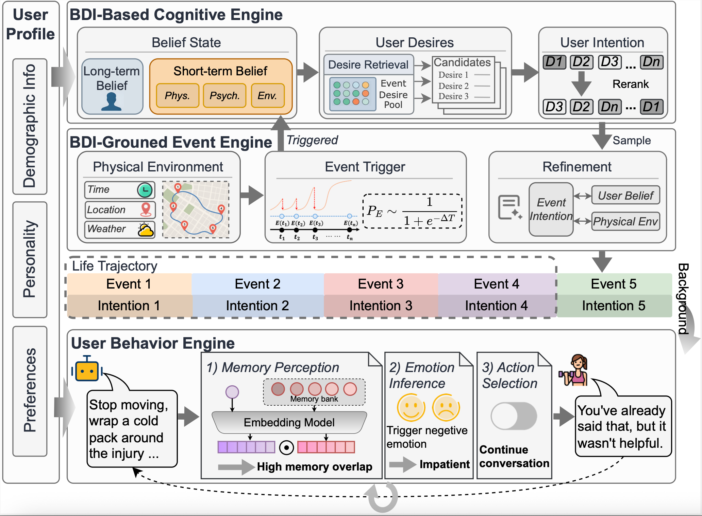

# LifeSim: Long-Horizon User Life Simulator for Personalized Assistant Evaluation

**Feiyu Duan<sup>1</sup>, Xuanjing Huang<sup>2</sup>, Zhongyu Wei<sup>1,3*</sup>**

<sup>1</sup> School of Data Science, Fudan University, China  
<sup>2</sup> School of Computer Science, Fudan University, China  
<sup>3</sup> Shanghai Innovation Institute  

✉️ fyduan25@m.fudan.edu.cn， {xjhuang, zywei}@fudan.edu.cn

This repository provides a research-oriented simulation framework for studying long-horizon interactions between a **user agent** and an **assistant agent** under structured life-event trajectories. The codebase is designed for controlled experimentation on preference inference, memory dynamics, and dialogue adaptation.



<video width="600" controls>
  <source src="resources/lifesimDemo_with_subtitle.mov" type="video/mp4">
</video>

## 1. Research Objective

LifeSim operationalizes a sequential interaction problem in which:

- a user profile is instantiated from structured demographic and preference attributes,
- a life-event engine emits event contexts over time,
- a user agent generates responses conditioned on profile, event context, and optional memory/emotion mechanisms,
- an assistant agent predicts intent, responds, and periodically summarizes user preferences.

This setup enables evaluation of longitudinal assistant behavior under non-stationary conversational contexts.

## 2. Code Structure

```text
src/
├── main_mp.py                    # Multi-thread simulation entrypoint
├── agents/
│   ├── user_agent.py             # User behavior generation + memory/emotion/action modules
│   ├── assistant_agent.py        # Intent prediction, response, and profile summarization
│   └── memory.py                 # In-memory and vector-backed memory abstractions
├── simulation/
│   └── conversation_simulator.py # Episode/event loop and logging orchestration
├── engine/
│   └── event_engine.py           # Offline event sequence loading and event generation
├── profiles/
│   └── profile_generator.py      # UserProfile parsing and profile retrieval
├── tools/
│   └── dense_retriever.py        # Retriever used by KV memory (Chroma-backed)
├── models/                       # API/local model wrappers and model loader
└── utils/                        # Logging, JSONL I/O, response parsing utilities
```

## 3. Installation

Install dependencies from the source requirements file:

```bash
pip install -r src/requirements.txt
```

> Note: the provided requirements list is comprehensive and includes GPU/vLLM-related packages. For lightweight reproduction, you may create a reduced environment containing only the libraries needed by your specific model backends and retriever settings.

## 4. Data and Resource Assumptions

The current `src/main_mp.py` pipeline expects several resources:

1. **Event and user profile JSONL files** (sequence-level events + user IDs).
2. **Preference dimension template JSON** (used by assistant summarization).
3. **Retriever embedding model** for vector memory.
4. **LLM backends** for user and assistant models (API or vLLM endpoints).

In the released code, some default paths are hard-coded to an internal filesystem. For external deployment, replace them with your local paths before running experiments.

## 5. Running the Main Pipeline

Use `src/main_mp.py` as the main entrypoint:

```bash
python src/main_mp.py \
  --user_model_path /path/to/user/model_or_name \
  --user_model_url <USER_MODEL_URL> \
  --user_model_api_key <USER_API_KEY> \
  --assistant_model_path gpt-5 \
  --assistant_model_url <ASSISTANT_MODEL_URL> \
  --assistant_model_api_key <ASSISTANT_API_KEY> \
  --chromadb_root /path/to/chromadb_root \
  --logs_root /path/to/logs_root \
  --n_events_per_sequence 10 \
  --n_threads 4 \
  --retriever_model_path /path/to/embedding/model
```

After simulation, you can evaluate assistant quality with the evaluator pipeline in `src/evaluation/eval.py` (and the corresponding analysis workflow in `src/evaluation/eval.ipynb`). The evaluation is organized as **LLM-as-a-judge** over multiple dimensions:

- **IR (Intent Recognition):** whether predicted intent matches the ground-truth intent checklist.
- **IC (Intent Completion):** whether assistant replies fulfill each intent dimension in context.
- **NAT (Naturalness):** 1–5 rating for fluency and conversational naturalness.
- **COH (Coherence):** 1–5 rating for logical consistency and contextual continuity.
- **PA (Preference Alignment):** whether replies align with each user preference dimension.
- **EA (Environment Alignment):** 1–5 rating for scene/environment feasibility and constraint awareness.
- **RR (Rigid Reasoning):** binary flag for whether the assistant fails to adapt after new constraints.

You can now run evaluation directly from bash:

```bash
python src/evaluation/eval.py \
  --logs_root /path/to/logs_root \
  --themes main_user_Qwen3-32B_assistant_gpt-5_total \
  --output_root /path/to/eval_outputs \
  --evaluator gpt_oss_120b \
  --base_url http://0.0.0.0:8002/v1 \
  --api_key <EVAL_API_KEY> \
  --metrics ir ic nat coh pa ea rr \
  --max_workers 32
```

Common options:
- `--themes`: one or more experiment folders under `logs_root`.
- `--metrics`: choose any subset of `ir ic nat coh pa ea rr`.
- `--model_path`: override evaluator model name/path when your endpoint expects a different model id.

`eval.ipynb` additionally shows post-processing and aggregation patterns (e.g., parsing judge outputs, computing per-theme/per-model scores, and plotting).

## 6. Citation

If you use this codebase in academic work, please cite the corresponding paper/project artifact (to be added by maintainers).
